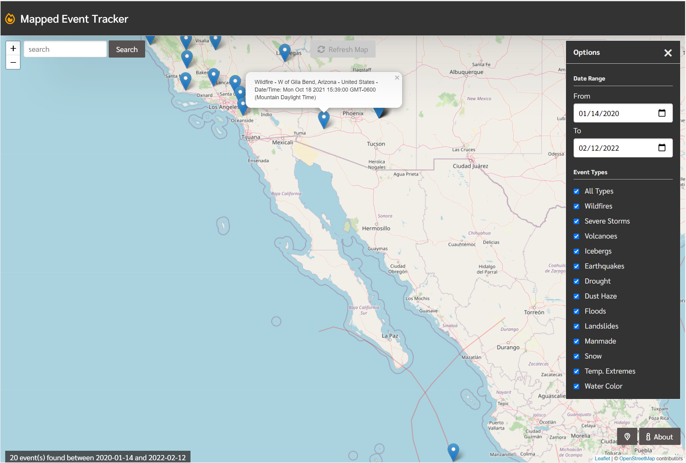
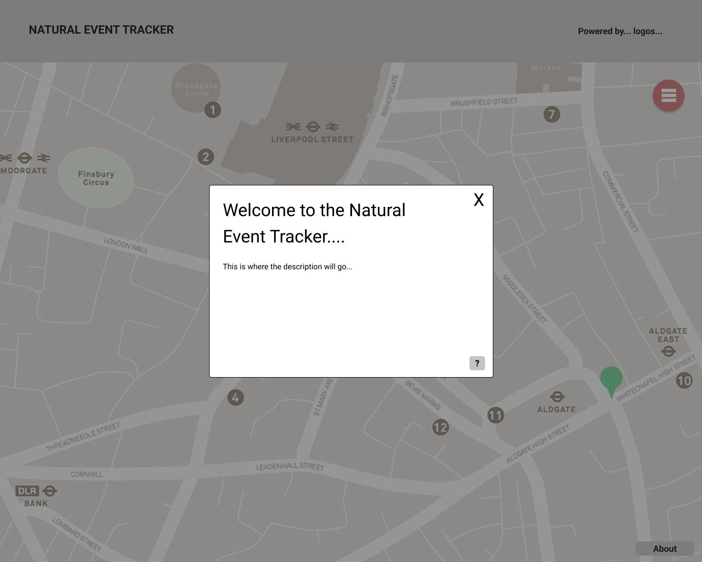
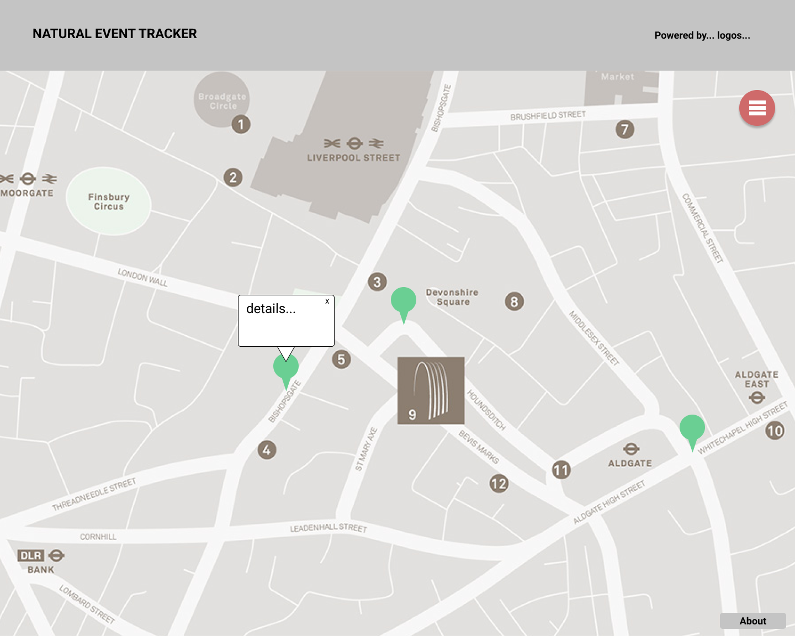
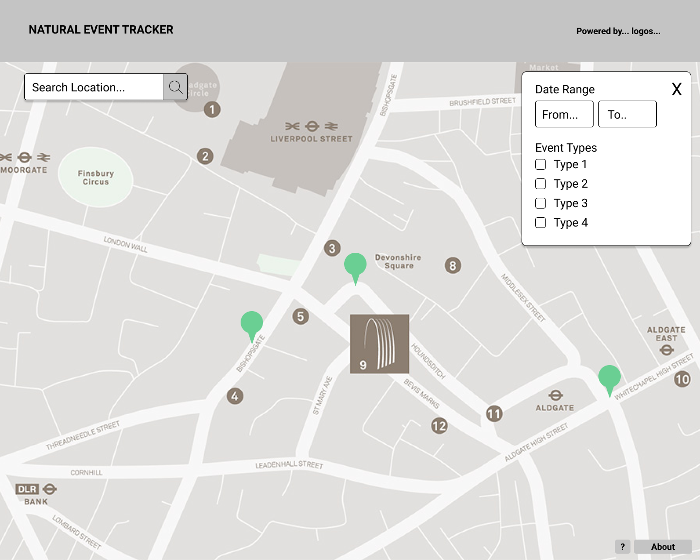

<h1 align="center">
  Mapped Event Tracker
</h1>

## Table of Contents
-[Description](#mapped-event-tracker)<br>
-[User Stories](#user-stories)<br>
-[Usage](#usage)<br>
-[Screenshot](#Screenshot)<br>
-[Wireframes](#lofi-wires)<br>
-[Built With](#built-with)<br>
-[Live](#live)

## Mapped Event Tracker
A map tracking natural events across the globe, with a search bar to look for events in specific places. The option to look for specific events and within date ranges is currently being added. 

## User Stories
As a concerned mother, I want to see if there are any natural events occurring around any of my family members, so that I can rest easy.
As a curious person, I want to see if that thing I just felt was actually an earthquake, so I can sate my curiousity.

## Usage
When loaded, a map will appear with a search bar, start by searching for a location you are interested in. Then adjust parameters from menu in top right for date range/ event types. In the bottom right is a help menu if needing to refresh on what the app can do.

## Screenshot


## LoFi Wires






The files are configured as follows:
```
Root Directory
│
│ --index.html
│
└───assets (folder)
    │
    └─── css (folder containing css style files)
    │
    └─── images (folder containing all image resources)
    │
    └─── js (folder containing JavaScript files)
```

## Built With
<ul>
  <li>HTML</li>
  <li>CSS</li>
  <li>JavaScript</li>
  <li><a href="https://fontawesome.com/">Font Awesome</a></li>
  <li><a href="https://leafletjs.com/">Leafletjs</a></li>
  <li><a href="https://jquery.com/" >jQuery</a></li>
  <li><a href="https://fonts.google.com/" >Google Fonts</a></li>
  <li><a href="https://purecss.io/" >Pure CSS</a></li>
  <li><a href="https://eonet.gsfc.nasa.gov/" >EONET Api</a></li>
  <li><a href="https://openweathermap.org/" >OpenWeatherMap Api</a></li>
  <li><a href="https://www.openstreetmap.org/" >OpenStreetMap Api</a></li>
</ul>

## Live
Can be found live at <a href= "https://skerans.github.io/Mapped-event-tracker/">Mapped Event Tracker</a>
